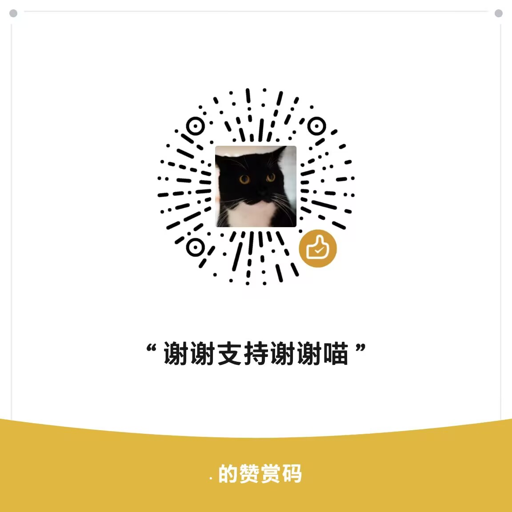

# devin-byok

让 **Devin**（原 Windsurf）使用你自己的模型服务（BYOK）。

- OpenAI 兼容 API / Anthropic Messages
- 免登录（pure_local）
- 图形界面一键启停、监控、模型管理
- 协议：**AGPL-3.0**（见 [LICENSE](LICENSE)）

仓库：https://github.com/cyberlieflife/devin-byok

## 用户怎么用（发布包）

### Windows

最终发布物是一个 `.exe` 文件（按 CPU 架构区分）：

```
devin-byok-<ver>-windows-amd64.exe   # x64（Intel / AMD）
devin-byok-<ver>-windows-arm64.exe   # arm64（Windows on ARM 原生）
```

1. 双击 `.exe`
2. 在 GUI 配置模型/供应商（保存到 `%USERPROFILE%\.devin-byok\config.yaml`）
3. 点 **启动服务**（自动 apply + LS wrapper）
4. **完全退出并重开 Devin**，选择 BYOK 模型

### macOS

最终发布物是一个 `.dmg` 文件：

```
devin-byok-<ver>-darwin-arm64.dmg
```

1. 双击 `.dmg`，将 `Devin BYOK.app` 拖入 `Applications`
2. 从“应用程序”打开 `Devin BYOK`
3. 在 GUI 配置模型/供应商（保存到 `~/Library/Application Support/devin-byok/config.yaml`）
4. 点 **启动服务**（自动 apply + LS wrapper）
5. **完全退出并重开 Devin**，选择 BYOK 模型

退出 GUI 会自动关闭服务并 restore。配置由 GUI 管理，包内不再附带 config 模板。

macOS 版本是普通 GUI 应用，会显示在 Dock 中；应用图标为狍子头像。

## 配置最少要写什么

```yaml
upstream:
  families:
    - uid: my-model
      label: My Model
      provider: openai
      base_url: https://api.example.com/v1
      api_key: "sk-xxx"
      upstream_model: my-upstream-model
      context_window: 128000
      max_tokens: 8192
  models:
    - id: my-model-medium
      label: My Model Medium
      upstream_model: my-upstream-model
      thinking: medium
      family_uid: my-model

features:
  pure_local: true
  enable_stream: true
  enable_cascade_tools: true

update:
  enabled: true
  repo: cyberlieflife/devin-byok
  asset_contains: "" # 留空时按当前平台自动匹配
  auto_apply: false
```

完整字段见 `config.example.yaml`。

## GUI 页面

| 页面 | 功能 |
|------|------|
| 监控 | 成功/失败、Token、缓存、DeepWiki/CodeMap、日志 |
| 模型 | Family 卡片；DeepWiki / CodeMap Fast·Smart 绑定 |
| 设置 | 工具/流式/pure_local、托盘自启、在线更新 |

## 开发者

### Windows
```powershell
git clone https://github.com/cyberlieflife/devin-byok.git
cd devin-byok
go build -o devin-byok.exe ./cmd/devin-byok
go build -ldflags "-H windowsgui" -o devin-byok-gui.exe ./cmd/devin-byok-gui
```

交叉编译 arm64（Windows on ARM，从 x64 机器）：
```powershell
$env:GOOS = "windows"; $env:GOARCH = "arm64"; $env:CGO_ENABLED = "0"
go build -o devin-byok-arm64.exe ./cmd/devin-byok
go build -ldflags "-H windowsgui" -o devin-byok-gui-arm64.exe ./cmd/devin-byok-gui
```

### macOS
```bash
git clone https://github.com/cyberlieflife/devin-byok.git
cd devin-byok
go build -o devin-byok ./cmd/devin-byok
go build -o devin-byok-gui ./cmd/devin-byok-gui
```

源码开发时仍可用完整 CLI：`install` / `start` / `stop` / `doctor` / `update`。

### 打发布包

Windows:
```powershell
.\scripts\pack-release.ps1                # x64（amd64）
.\scripts\pack-release.ps1 -Arch arm64     # arm64（交叉编译）
# dist/devin-byok-<ver>-windows-amd64.exe
# dist/devin-byok-<ver>-windows-arm64.exe
```

macOS:
```bash
./scripts/pack-release.sh
# dist/devin-byok-<ver>-darwin-arm64.dmg
```

### 发版

```bash
./scripts/pack-release.sh
git add -A && git commit -m "release: v1.2.0"
git tag v1.2.0
git push origin master --tags
# 上传各平台 dmg/exe + sha256 到 GitHub Release
gh release create v1.2.0 dist/devin-byok-1.2.0-darwin-arm64.dmg dist/devin-byok-1.2.0-darwin-arm64.dmg.sha256 dist/devin-byok-1.2.0-darwin-x64.dmg dist/devin-byok-1.2.0-darwin-x64.dmg.sha256 dist/devin-byok-1.2.0-windows-amd64.exe dist/devin-byok-1.2.0-windows-amd64.exe.sha256 --title v1.2.0
```

### 在线更新

GUI：设置 → 检查更新 / 下载并更新  

从 GitHub Releases 下载当前平台的 `.exe` 或 `.dmg`，有 `.sha256` 则校验后替换应用。

## 数据路径

### Windows
| 用途 | 路径 |
|------|------|
| 配置 | `%USERPROFILE%\.devin-byok\config.yaml` |
| Devin 设置 | `%APPDATA%\Devin\User\settings.json` |
| apply 元数据 | `%APPDATA%\devin-byok\last-apply.json` |
| 指标 | `%APPDATA%\devin-byok\metrics.json` |
| GUI 偏好 | `%APPDATA%\devin-byok\gui.json` |

### macOS
| 用途 | 路径 |
|------|------|
| 配置 | `~/Library/Application Support/devin-byok/config.yaml` |
| Devin 设置 | `~/Library/Application Support/Devin/User/settings.json` |
| apply 元数据 | `~/Library/Application Support/devin-byok/last-apply.json` |
| 指标 | `~/Library/Application Support/devin-byok/metrics.json` |
| GUI 偏好 | `~/Library/Application Support/devin-byok/gui.json` |

## 单文件 GUI

### Windows
发布包只需 `devin-byok-gui.exe`（+ `START.txt`）：内嵌 local-api、默认配置模板、LS wrapper。

- 配置：`%USERPROFILE%\.devin-byok\config.yaml`（首次从内置模板生成，可在 GUI 修改）
- 日志：`%APPDATA%\devin-byok\gui.log`
- 退出 GUI：自动停止服务并 restore
- 检测到 Devin 安装目录时自动植入 language_server 包装器

### macOS
发布包只需一个 `Devin BYOK.app`：内嵌 local-api、默认配置模板、LS wrapper，并带有 Dock 狍子图标。

- 配置：`~/Library/Application Support/devin-byok/config.yaml`（首次从内置模板生成，可在 GUI 修改）
- 日志：`~/Library/Application Support/devin-byok/gui.log`
- 退出 GUI：自动停止服务并 restore
- 检测到 Devin 安装目录时自动植入 language_server 包装器

## 许可证

GNU Affero General Public License v3.0 — 见 [LICENSE](LICENSE)。

## 赞赏支持

如果觉得项目好可以赞赏我支持一下谢谢喵


## 新电脑安装与本地账户

1. 安装最新版 Devin，并至少启动一次，让 Devin 创建用户数据目录；不需要登录官网账户。
2. 完全退出 Devin。
3. 安装并打开 Devin BYOK，在“模型”页配置 Family 的 Base URL、API Key 和上游模型 ID。
4. 在“设置”页点击“一键创建并导入”。
5. 完全退出并重启 Devin，在模型列表中选择已配置的 BYOK 模型。

一键导入会为当前电脑随机生成独立的本地虚拟身份，并写入 Devin 的本地服务地址和启动设置。该身份不是 Devin 官网账户，不包含或复制官网 token、Cookie、会话与额度，也不支持官网云同步；更换电脑时会生成新的本地身份。
